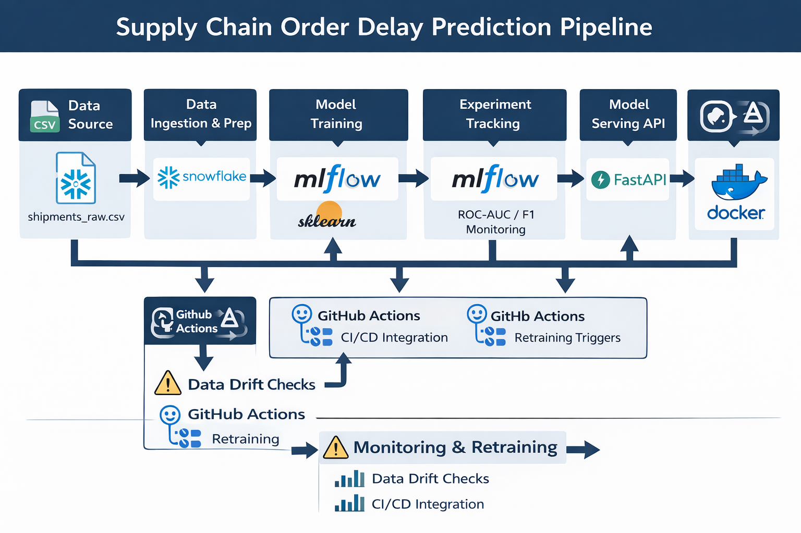

#  Supply Chain Order Delay Prediction Engine
### **Production MLOps Pipeline: Snowflake ↔️ MLflow ↔️ FastAPI ↔️ Docker**


## 📖 Project Vision
This repository contains a production-grade machine learning system designed to predict **Late Delivery Risks** in global logistics. Unlike a simple model script, this is a **modular ecosystem** built for reliability, scalability, and auditability. It bridges the gap between a cloud data warehouse (**Snowflake**) and a real-time inference service (**FastAPI**), protected by a **Statistical Drift Audit** layer.

---

## Detailed System Architecture & Design Patterns

<p align="center">
  
</p>

### 1. Robust Data Ingestion & Cleaning
Production data is rarely clean. This pipeline implements an **Encoding-Aware Ingestion** strategy:

- **Fail-Safe Loading:** As seen in production logs, the system automatically detects `UTF-8` failures and falls back to `Latin-1`, preventing pipeline crashes during automated runs.
- **Config-Driven Cleaning:** Instead of hard-coding logic, all NA-filling (`Sales: 0`, `Quantity: 1`) and type conversions are handled via `config.yaml`. 
- **Validation:** The cleaner ensures 0% data loss during type casting, verifying that the 180k+ records maintain integrity from raw to processed states.

### 2. Feature Store & Engineering Strategy
To ensure consistency between training and serving (preventing **Training-Serving Skew**):

- **Snowflake Integration:** Engineered features are synced back to Snowflake, allowing other teams to consume a validated "Source of Truth."
- **Temporal & Business Logic:** We extract high-signal features such as `order_hour` and `is_weekend`, alongside custom business logic like `discount_per_item`.
- **Automated Pruning:** A statistical selector automatically drops zero-variance columns and low-correlation features ($< 0.01$). In current runs, this optimized the feature space from 23 down to 16 high-impact variables.


### 3. The "Model Tournament" (Auto-Selection)
Rather than assuming one algorithm is best, the system runs a competitive "Champion vs. Challenger" tournament:

- **MLflow Tracking:** Every experiment logs hyperparameters and metrics. Current logs show a **Random Forest Champion** achieving an **ROC-AUC of 0.84**, significantly outperforming the Logistic Regression baseline.
- **Candidate Models:** Automated evaluation of **Logistic Regression**, **Random Forest**, and **HistGradientBoosting**.
- **Artifact Persistence:** The winning model is automatically serialized to the `artifacts/` folder, ensuring the FastAPI service always loads the most performant version.

### 4. Enterprise Logging & Observability
A system is only as good as its visibility. This project implements a production-grade monitoring strategy:

- **Log Rotation:** The custom `logger.py` implements a retention policy, keeping only the last 10 logs per component. This prevents disk-space exhaustion during high-frequency retraining.
- **Component-Level Tracking:** Every stage (Ingestion, Preparation, Modeling) generates independent, timestamped logs, allowing for rapid debugging of "silent" failures in the pipeline.
- **Unified Entry Point:** `main.py` acts as the orchestrator, ensuring a strict sequential flow: Ingestion → Cleaning → Engineering → Modeling.

---

## Repository Structure

```bash
.
├── .github/workflows/       # CI/CD: Automated Retraining & Deployment
├── config/                  # Centralized YAML configurations (brain of the project)
├── src/
│   ├── api/                 # FastAPI Implementation (App, Schema, Predictor)
│   ├── ingestion/           # Snowflake & CSV Ingestion Logic
│   ├── preparation/         # Cleaning & Feature Engineering Classes
│   ├── modeling/            # Tournament Trainer & MLflow Tracking
│   ├── monitoring/          # Statistical Drift Detection (KS-Test/Chi2)
│   └── utils/               # Config Loaders & Rotation Loggers (last 10 runs)
├── artifacts/               # Serialized Champion Models (.pkl)
├── logs/                    # Execution logs (Automated rotation)
├── monitoringresults/       # JSON Drift Reports
└── Dockerfile               # Production Containerization
```

---

##  Execution Guide & Workflow

This project is designed as a linear MLOps pipeline. Each stage generates artifacts (logs, processed data, or models) required by the next stage.

### 1. Environment Setup

To ensure reproducibility, install the exact versions of the dependencies used during development.

```bash
# Create and activate a virtual environment
python -m venv .venv
source .venv/bin/activate  # Windows: .venv\Scripts\activate

# Install dependencies
pip install -r requirements.txt
```

---

### Phase 1: The Training Pipeline

Running the orchestrator triggers the full data-to-model lifecycle. This script automates ingestion, cleaning, feature engineering, and the "Model Tournament."

```bash
python main.py
```

Pipeline Actions:

- **Ingestion:** Loads `shipments_raw.csv` with automatic encoding fallback.
- **Cleaning:** Implements config-driven NA filling and type casting.
- **Engineering:** Extracts temporal features and performs correlation-based pruning.

---

### Phase 2: Experiment Tracking (MLflow)

Every run is tracked. You can compare the performance of Logistic Regression, Random Forest, and Gradient Boosting side-by-side.

```bash
mlflow ui
```

View metrics at:

```
http://127.0.0.1:5000
```

---

### Phase 3: Data Drift Audit (Monitoring)

Before deploying, or as a scheduled health check, run the drift audit. This compares the Training Baseline against Current Data.

```bash
python src/monitoring/monitor_drift.py
```

Statistical Tests Performed:

- **Numerical Features:** Kolmogorov-Smirnov (KS) Test (`p < 0.05`)
- **Categorical Features:** Chi-Square Contingency Test (`p < 0.05`)

---

### Phase 4: Production API Serving (FastAPI)

Deploy the winning model as a REST API. The service includes a predictor class that handles the mapping of API inputs to the model's expected feature names.

```bash
uvicorn src.api.app:app --reload
```

---

### Phase 5: Containerization (Docker)

Package the entire environment (OS, Python, and Libraries) to ensure "run anywhere" stability.

```bash
# Build the image
docker build -t order-delay-api .

# Run the container
docker run -d -p 8000:8000 --name shipment-service order-delay-api
```

---

## Monitoring & Governance

To prevent **Silent Model Decay**, this system uses automated statistical guards:

- **Numerical Drift:** Compares the cumulative distribution of live features against the training baseline.
- **Categorical Drift:** Ensures the proportions of categories (e.g., Market, Shipping Mode) haven't shifted significantly.
- **Gatekeeping:** The generated `drift_report.json` serves as a programmatic **CI/CD gate** — if drift is detected, deployment of a new model can automatically be blocked.

---


## ⚙️ Tech Stack

| Layer | Technology |
|-------|------------|
| Data Warehouse | Snowflake |
| Data Processing | Python, Pandas |
| Machine Learning | Scikit-Learn |
| Experiment Tracking | MLflow |
| API Serving | FastAPI |
| Containerization | Docker |
| CI/CD | GitHub Actions |
| Monitoring | Statistical Drift Checks (KS Test, Chi² Test) |

---

## API Example

Example request:

```bash
curl -X POST "http://127.0.0.1:8000/predict" \
-H "Content-Type: application/json" \
-d '{
  "Days_for_shipment_scheduled": 5,
  "order_hour": 14,
  "Type": "Online",
  "Category_Name": "Furniture",
  "Customer_City": "New York",
  "Customer_Country": "USA",
  "Customer_Segment": "Corporate",
  "Customer_State": "NY",
  "Department_Name": "Home Office",
  "Market": "East",
  "Order_City": "Boston",
  "Order_Country": "USA",
  "Order_Region": "Northeast",
  "Order_State": "MA",
  "Shipping_Mode": "Standard Class"
}'
```

Example response:

```json
{
  "late_delivery_risk": 0.73,
  "prediction": "Late"
}
```

---

## CI/CD Automation

The project includes automated workflows using **GitHub Actions**:

- Automated **model retraining**
- **Drift monitoring checks**
- **CI pipeline validation**
- Artifact generation for new champion models

Workflows are located in:

```
.github/workflows/
```
## Technical "War Stories" & Decisions

**The Encoding Challenge**

Implemented a multi-pass ingestion strategy (`UTF-8` → `Latin-1`) to ensure high pipeline availability despite messy raw data.

**Training-Serving Skew**

Decoupled API design from raw data names using a mapping layer in `predictor.py`, making the system robust to upstream field name changes.

**Memory Management**

Implemented automated log rotation in `logger.py` to ensure long-term stability in production environments by keeping only the 10 most recent runs.


---
